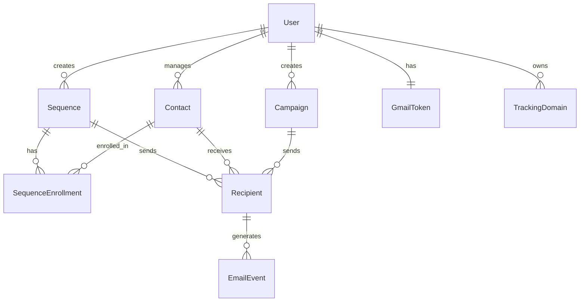

# 🗄️ LOUMASS Database Schema Documentation

## 📋 Overview

LOUMASS uses a PostgreSQL database with Prisma ORM for type-safe database operations. The schema is designed for multi-tenant SaaS architecture with proper data isolation and performance optimization.

---

## 🏗️ Architecture Overview

### Database Technology
- **Database**: PostgreSQL 14+
- **ORM**: Prisma 5.x
- **Connection**: Connection pooling via Prisma
- **Migrations**: Prisma Migrate
- **Type Safety**: Full TypeScript integration

### Multi-Tenant Design
- **User Isolation**: All data scoped to userId
- **Soft Deletion**: Cascade deletes via foreign keys
- **Data Integrity**: Foreign key constraints enforced
- **Performance**: Strategic indexing on frequently queried fields

---

## 📊 Core Models

### 1. User Model

```prisma
model User {
  id        String   @id @default(cuid())
  email     String   @unique
  name      String?
  image     String?
  createdAt DateTime @default(now())
  updatedAt DateTime @updatedAt

  // Relations
  sequences       Sequence[]
  contacts        Contact[]
  campaigns       Campaign[]
  trackingDomains TrackingDomain[]
  gmailTokens     GmailToken[]

  @@map("User")
}
```

**Purpose**: Core user accounts for multi-tenant architecture  
**Key Features**:
- Unique email addresses
- OAuth integration ready (Google)
- Timestamps for audit trails
- Cascading relationships

**Indexes**:
- Primary: `id` (cuid)
- Unique: `email`

---

### 2. Sequence Model ⭐

```prisma
model Sequence {
  id              String   @id @default(cuid())
  userId          String
  name            String
  description     String?
  status          String   @default("DRAFT") // DRAFT, ACTIVE, PAUSED
  triggerType     String   @default("manual") // manual, on_signup, on_event
  trackingEnabled Boolean  @default(true)
  steps           Json     // Array of SequenceStep objects
  createdAt       DateTime @default(now())
  updatedAt       DateTime @updatedAt

  // Relations
  user         User                   @relation(fields: [userId], references: [id], onDelete: Cascade)
  enrollments  SequenceEnrollment[]
  recipients   Recipient[]

  @@index([userId, status])
  @@index([createdAt])
  @@map("Sequence")
}
```

**Purpose**: Email automation sequences with visual workflow steps  
**Key Features**:
- JSON storage for flexible step definitions
- Status tracking (DRAFT/ACTIVE/PAUSED)
- Multiple trigger types
- Tracking preferences per sequence

**Step Structure** (JSON field):
```typescript
interface SequenceStep {
  id: string
  type: 'email' | 'delay' | 'condition'
  subject?: string                    // Email steps
  content?: string                    // Email steps
  delay?: {                          // Delay steps
    days: number
    hours: number
    minutes: number
  }
  condition?: {                      // Condition steps
    type: 'opened' | 'clicked' | 'replied' | 'not_opened' | 'not_clicked'
    referenceStep?: string
    trueBranch?: string[]
    falseBranch?: string[]
  }
  replyToThread?: boolean
  trackingEnabled?: boolean
  position: { x: number, y: number } // UI positioning
  nextStepId: string | null          // Flow control
}
```

**Indexes**:
- Composite: `(userId, status)` for filtering user sequences by status
- Single: `createdAt` for chronological ordering

---

### 3. Contact Model

```prisma
model Contact {
  id          String   @id @default(cuid())
  userId      String
  email       String
  firstName   String?
  lastName    String?
  tags        Json?    // Array of strings
  variables   Json?    // Key-value pairs for personalization
  status      String   @default("ACTIVE") // ACTIVE, INACTIVE, UNSUBSCRIBED
  createdAt   DateTime @default(now())
  updatedAt   DateTime @updatedAt

  // Relations
  user        User                   @relation(fields: [userId], references: [id], onDelete: Cascade)
  recipients  Recipient[]
  enrollments SequenceEnrollment[]

  @@unique([userId, email])
  @@index([userId, status])
  @@index([email])
  @@map("Contact")
}
```

**Purpose**: Contact management with personalization data  
**Key Features**:
- Unique email per user (multi-tenant)
- Tag system for segmentation
- Custom variables for email personalization
- Status tracking for unsubscribes

**Computed Fields** (Application level):
```typescript
// Generated by API/UI layers
interface ContactWithComputedFields extends Contact {
  displayName: string        // firstName + lastName || email
  engagementRate: number    // Calculated from email events
}
```

**Indexes**:
- Unique: `(userId, email)` prevents duplicate contacts per user
- Composite: `(userId, status)` for filtering by status
- Single: `email` for cross-user email lookups (admin features)

---

### 4. Campaign Model

```prisma
model Campaign {
  id              String   @id @default(cuid())
  userId          String
  name            String
  subject         String
  content         String
  status          String   @default("DRAFT") // DRAFT, SCHEDULED, SENDING, SENT, PAUSED
  trackingEnabled Boolean  @default(true)
  scheduledAt     DateTime?
  sentAt          DateTime?
  gmailThreadId   String?  // For reply-to-thread functionality
  createdAt       DateTime @default(now())
  updatedAt       DateTime @updatedAt

  // Relations
  user       User         @relation(fields: [userId], references: [id], onDelete: Cascade)
  recipients Recipient[]

  @@index([userId, status])
  @@index([scheduledAt])
  @@map("Campaign")
}
```

**Purpose**: One-time email campaigns  
**Key Features**:
- Scheduling capabilities
- Gmail thread integration
- Tracking toggles
- Status progression tracking

---

### 5. SequenceEnrollment Model

```prisma
model SequenceEnrollment {
  id          String    @id @default(cuid())
  sequenceId  String
  contactId   String
  status      String    @default("ACTIVE") // ACTIVE, COMPLETED, PAUSED, FAILED
  currentStep String?   // Current step ID in sequence
  enrolledAt  DateTime  @default(now())
  completedAt DateTime?
  pausedAt    DateTime?
  failedAt    DateTime?
  failureReason String?

  // Relations
  sequence Sequence @relation(fields: [sequenceId], references: [id], onDelete: Cascade)
  contact  Contact  @relation(fields: [contactId], references: [id], onDelete: Cascade)

  @@unique([sequenceId, contactId])
  @@index([status])
  @@index([currentStep])
  @@map("SequenceEnrollment")
}
```

**Purpose**: Tracks contact progression through sequences  
**Key Features**:
- Unique enrollment per contact per sequence
- Current step tracking for resumption
- Failure reason logging
- Timeline tracking (enrolled, completed, paused)

---

### 6. Recipient Model

```prisma
model Recipient {
  id         String    @id @default(cuid())
  campaignId String?   // For campaign emails
  sequenceId String?   // For sequence emails
  contactId  String
  status     String    @default("PENDING") // PENDING, SENT, FAILED, BOUNCED
  sentAt     DateTime?
  failureReason String?
  trackingId String?   @unique // For open/click tracking
  gmailMessageId String? // Gmail's message ID

  // Relations
  campaign Campaign? @relation(fields: [campaignId], references: [id], onDelete: Cascade)
  sequence Sequence? @relation(fields: [sequenceId], references: [id], onDelete: Cascade)
  contact  Contact   @relation(fields: [contactId], references: [id], onDelete: Cascade)
  events   EmailEvent[]

  @@index([status])
  @@index([sentAt])
  @@index([trackingId])
  @@map("Recipient")
}
```

**Purpose**: Individual email send records  
**Key Features**:
- Links emails to campaigns or sequences
- Gmail message ID for thread management
- Unique tracking ID per email
- Send status and failure tracking

---

### 7. EmailEvent Model

```prisma
model EmailEvent {
  id          String   @id @default(cuid())
  recipientId String
  type        String   // SENT, DELIVERED, OPENED, CLICKED, REPLIED, BOUNCED, COMPLAINED
  timestamp   DateTime @default(now())
  data        Json?    // Additional event data (click URL, user agent, etc.)
  ipAddress   String?
  userAgent   String?

  // Relations
  recipient Recipient @relation(fields: [recipientId], references: [id], onDelete: Cascade)

  @@index([recipientId, type])
  @@index([timestamp])
  @@map("EmailEvent")
}
```

**Purpose**: Email engagement tracking  
**Key Features**:
- Multiple event types for comprehensive tracking
- Timestamp precision for analytics
- IP and user agent for fraud detection
- Flexible data storage for event-specific information

---

### 8. TrackingDomain Model

```prisma
model TrackingDomain {
  id         String   @id @default(cuid())
  userId     String
  domain     String   @unique
  verified   Boolean  @default(false)
  dnsRecords Json?    // Required DNS records
  createdAt  DateTime @default(now())
  updatedAt  DateTime @updatedAt

  // Relations
  user User @relation(fields: [userId], references: [id], onDelete: Cascade)

  @@index([userId])
  @@map("TrackingDomain")
}
```

**Purpose**: Custom domain tracking for better deliverability  
**Key Features**:
- Domain verification status
- DNS record storage and validation
- One domain per user (can be extended)

---

### 9. GmailToken Model

```prisma
model GmailToken {
  id           String    @id @default(cuid())
  userId       String    @unique
  accessToken  String    // Encrypted
  refreshToken String    // Encrypted
  expiresAt    DateTime
  scope        String
  createdAt    DateTime  @default(now())
  updatedAt    DateTime  @updatedAt

  // Relations
  user User @relation(fields: [userId], references: [id], onDelete: Cascade)

  @@map("GmailToken")
}
```

**Purpose**: Secure Gmail API token storage  
**Key Features**:
- Encrypted token storage
- Automatic expiration handling
- Scope tracking for permissions
- One token per user

---

## 🔗 Relationship Diagram



---

## 📈 Performance Considerations

### Indexing Strategy

**High-frequency Queries**:
```prisma
// User's sequences by status
@@index([userId, status])

// Contact lookup by email
@@unique([userId, email])

// Event tracking
@@index([recipientId, type])

// Chronological ordering
@@index([createdAt])
@@index([timestamp])
```

### Query Patterns

**Efficient User Data Fetching**:
```typescript
// Good: Include userId in all queries
const sequences = await prisma.sequence.findMany({
  where: { 
    userId: session.user.id,  // Always filter by user
    status: 'ACTIVE' 
  }
})

// Bad: Missing userId filter
const sequences = await prisma.sequence.findMany({
  where: { status: 'ACTIVE' }  // Exposes all users' data!
})
```

**Optimized Relationship Loading**:
```typescript
// Use select to limit fields
const sequences = await prisma.sequence.findMany({
  select: {
    id: true,
    name: true,
    status: true,
    _count: {
      select: { enrollments: true }
    }
  },
  where: { userId: session.user.id }
})
```

---

## 🛡️ Security Implementation

### Multi-Tenant Isolation

**Row-Level Security** (Application enforced):
```typescript
// Every query MUST include userId filter
const getUserSequences = async (userId: string) => {
  return prisma.sequence.findMany({
    where: { userId }  // Critical for security
  })
}
```

**Cascading Deletes**:
```prisma
// User deletion removes all associated data
user User @relation(fields: [userId], references: [id], onDelete: Cascade)
```

### Data Encryption

**Sensitive Fields**:
- Gmail tokens stored encrypted
- Email content can be encrypted (future enhancement)
- IP addresses hashed for privacy compliance

---

## 🔄 Migration Strategy

### Current Migration Status
```bash
# Check migration status
npx prisma migrate status

# Apply pending migrations
npx prisma migrate deploy

# Generate client after schema changes
npx prisma generate
```

### Schema Evolution Pattern
1. **Additive Changes**: New optional fields
2. **Non-breaking**: Default values for required fields
3. **Breaking Changes**: Data migration scripts required

**Example Migration**:
```sql
-- Add new column with default
ALTER TABLE "Sequence" ADD COLUMN "priority" INTEGER DEFAULT 0;

-- Create index
CREATE INDEX "Sequence_priority_idx" ON "Sequence"("priority");
```

---

## 📊 Analytics Queries

### Common Analytics Patterns

**Sequence Performance**:
```sql
SELECT 
  s.name,
  COUNT(se.id) as enrollments,
  COUNT(CASE WHEN se.status = 'COMPLETED' THEN 1 END) as completed,
  AVG(EXTRACT(EPOCH FROM (se.completedAt - se.enrolledAt))/3600) as avg_hours_to_complete
FROM "Sequence" s
LEFT JOIN "SequenceEnrollment" se ON s.id = se.sequenceId
WHERE s.userId = $1
GROUP BY s.id, s.name;
```

**Email Engagement**:
```sql
SELECT 
  ee.type,
  COUNT(*) as event_count,
  COUNT(DISTINCT r.contactId) as unique_contacts
FROM "EmailEvent" ee
JOIN "Recipient" r ON ee.recipientId = r.id
JOIN "Campaign" c ON r.campaignId = c.id
WHERE c.userId = $1
GROUP BY ee.type;
```

---

## 🧪 Testing Data

### Seed Data Structure
```typescript
// Test user with sample data
const testUser = {
  email: "test@example.com",
  name: "Test User",
  sequences: [
    {
      name: "Welcome Series",
      steps: [
        { id: "email-1", type: "email", subject: "Welcome!" },
        { id: "delay-1", type: "delay", delay: { days: 1, hours: 0, minutes: 0 } }
      ]
    }
  ],
  contacts: [
    { email: "contact1@example.com", firstName: "John", lastName: "Doe" }
  ]
}
```

### Test Database Setup
```bash
# Create test database
createdb loumass_test

# Run migrations
DATABASE_URL="postgresql://localhost/loumass_test" npx prisma migrate deploy

# Seed test data
DATABASE_URL="postgresql://localhost/loumass_test" npx prisma db seed
```

---

## 🔍 Monitoring & Maintenance

### Database Health Checks
```sql
-- Check database size
SELECT pg_size_pretty(pg_database_size('loumass_production'));

-- Check slow queries
SELECT query, mean_time, calls 
FROM pg_stat_statements 
ORDER BY mean_time DESC 
LIMIT 10;

-- Check connection count
SELECT count(*) FROM pg_stat_activity;

-- Check index usage
SELECT schemaname, tablename, indexname, idx_tup_read, idx_tup_fetch
FROM pg_stat_user_indexes
ORDER BY idx_tup_read DESC;
```

### Backup Strategy
- **Automated**: Vercel Postgres automatic backups
- **Manual**: `pg_dump` for additional security
- **Recovery Testing**: Monthly backup restoration tests

---

## 🚀 Future Enhancements

### Planned Schema Changes

**Short-term**:
1. **Email Templates** - Reusable email templates
2. **Webhook Endpoints** - External integration triggers
3. **Team Management** - Multi-user workspace support

**Medium-term**:
1. **Advanced Segmentation** - Dynamic contact filtering
2. **A/B Testing** - Campaign variation tracking
3. **Revenue Tracking** - Customer lifetime value metrics

**Long-term**:
1. **Data Warehouse Integration** - Analytics data pipeline
2. **Multi-region Support** - Geographic data distribution
3. **Audit Logging** - Comprehensive change tracking

---

## 📋 Development Guidelines

### Schema Modification Process
1. **Design Review**: Discuss changes with team
2. **Migration Script**: Write safe migration
3. **Backup**: Ensure recent backup exists
4. **Test Migration**: Run on staging database
5. **Deploy**: Apply to production during maintenance window
6. **Verify**: Confirm data integrity post-migration

### Best Practices
- Always include `userId` filters for multi-tenant security
- Use transactions for multi-table operations
- Index frequently queried fields
- Avoid N+1 queries with proper includes/selects
- Use Prisma's type safety features
- Document complex queries and business logic

---

**Last Updated**: January 2025  
**Schema Version**: v1.0 - Core models implemented  
**Migration Status**: All migrations applied to production