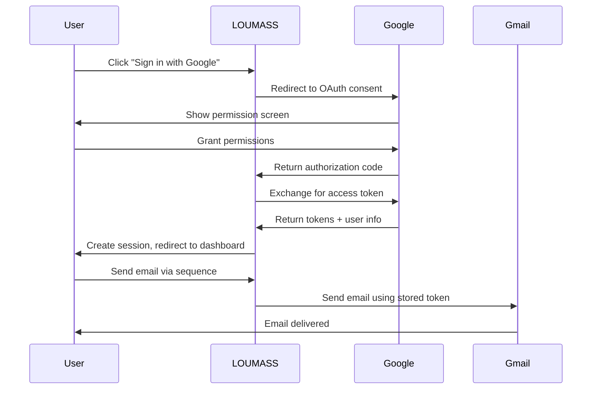

# 🔗 LOUMASS Google Integration Guide

## 📋 Overview

This document covers the complete Google integration setup for LOUMASS, including OAuth 2.0 authentication, Gmail API integration, Google Cloud Console configuration, and security best practices. Essential for understanding and maintaining the Google services integration.

---

## 🏗️ Architecture Overview

### Integration Components
- **Google OAuth 2.0**: User authentication and authorization
- **Gmail API**: Email sending and management
- **Google Cloud Console**: Project and API management
- **NextAuth.js**: Authentication provider integration
- **Token Management**: Secure storage and refresh of access tokens

### Data Flow


---

## 🔧 Google Cloud Console Setup

### 1. Project Creation

#### Create New Project
1. **Access**: [Google Cloud Console](https://console.cloud.google.com)
2. **Create Project**:
   ```
   Project Name: LOUMASS Email Marketing
   Project ID: loumass-email-marketing-2025
   Organization: Your Organization (optional)
   ```
3. **Enable Billing**: Required for production usage
4. **Note Project Number**: Used for API quotas and monitoring

### 2. Enable Required APIs

#### Gmail API
```bash
# Enable Gmail API
gcloud services enable gmail.googleapis.com --project=loumass-email-marketing-2025
```

**Manual Steps**:
1. Navigate to **APIs & Services** → **Library**
2. Search for "Gmail API"
3. Click **Enable**
4. Configure quotas if needed

#### Additional APIs (Optional)
- **Google People API**: For contact information
- **Google Drive API**: For attachment handling (future)
- **Cloud Monitoring API**: For usage tracking

### 3. OAuth 2.0 Configuration

#### Create OAuth Client
1. **Navigate**: APIs & Services → Credentials
2. **Create Credentials** → OAuth client ID
3. **Application Type**: Web application
4. **Name**: `LOUMASS Web Client`

#### Authorized Redirect URIs
```
Development: http://localhost:3000/api/auth/callback/google
Staging: https://loumass-staging.vercel.app/api/auth/callback/google
Production: https://loumassbeta.vercel.app/api/auth/callback/google
```

#### OAuth Consent Screen Configuration
```json
{
  "applicationName": "LOUMASS Email Marketing",
  "userSupportEmail": "support@loumass.com",
  "developerContact": "developer@loumass.com",
  "applicationLogo": "https://loumass.com/logo.png",
  "privacyPolicyUrl": "https://loumass.com/privacy",
  "termsOfServiceUrl": "https://loumass.com/terms",
  "applicationHomepage": "https://loumass.com"
}
```

#### Scopes Configuration
```json
{
  "scopes": [
    "email",
    "profile", 
    "https://www.googleapis.com/auth/gmail.send",
    "https://www.googleapis.com/auth/gmail.readonly",
    "https://www.googleapis.com/auth/gmail.modify",
    "https://www.googleapis.com/auth/gmail.labels"
  ]
}
```

**Scope Descriptions**:
- `email`: User's email address
- `profile`: Basic profile information
- `gmail.send`: Send emails on user's behalf
- `gmail.readonly`: Read email messages and settings
- `gmail.modify`: Modify emails and settings
- `gmail.labels`: Manage email labels

---

## 🔐 OAuth 2.0 Implementation

### NextAuth.js Configuration

#### Provider Setup
```typescript
// lib/auth.ts
import { NextAuthOptions } from 'next-auth'
import GoogleProvider from 'next-auth/providers/google'

export const authOptions: NextAuthOptions = {
  providers: [
    GoogleProvider({
      clientId: process.env.GOOGLE_CLIENT_ID!,
      clientSecret: process.env.GOOGLE_CLIENT_SECRET!,
      authorization: {
        params: {
          scope: [
            'openid',
            'email', 
            'profile',
            'https://www.googleapis.com/auth/gmail.send',
            'https://www.googleapis.com/auth/gmail.readonly',
            'https://www.googleapis.com/auth/gmail.modify',
            'https://www.googleapis.com/auth/gmail.labels'
          ].join(' '),
          access_type: 'offline',
          prompt: 'consent',
        },
      },
    }),
  ],
  callbacks: {
    async jwt({ token, account }) {
      if (account) {
        // Save tokens to JWT
        token.accessToken = account.access_token
        token.refreshToken = account.refresh_token
        token.expiresAt = account.expires_at
      }
      return token
    },
    async session({ session, token }) {
      // Send properties to the client
      session.accessToken = token.accessToken
      session.error = token.error
      return session
    },
  },
  events: {
    async signIn({ user, account, profile }) {
      if (account?.provider === 'google') {
        // Store Gmail tokens in database
        await storeGmailTokens(user.id, {
          accessToken: account.access_token!,
          refreshToken: account.refresh_token!,
          expiresAt: new Date(account.expires_at! * 1000),
          scope: account.scope!,
        })
      }
    },
  },
}
```

#### Token Storage Service
```typescript
// services/gmail-tokens.ts
import { prisma } from '@/lib/prisma'
import { encrypt, decrypt } from '@/lib/encryption'

interface GmailTokens {
  accessToken: string
  refreshToken: string
  expiresAt: Date
  scope: string
}

export async function storeGmailTokens(userId: string, tokens: GmailTokens) {
  await prisma.gmailToken.upsert({
    where: { userId },
    create: {
      userId,
      accessToken: encrypt(tokens.accessToken),
      refreshToken: encrypt(tokens.refreshToken),
      expiresAt: tokens.expiresAt,
      scope: tokens.scope,
    },
    update: {
      accessToken: encrypt(tokens.accessToken),
      refreshToken: encrypt(tokens.refreshToken),
      expiresAt: tokens.expiresAt,
      scope: tokens.scope,
    },
  })
}

export async function getGmailTokens(userId: string): Promise<GmailTokens | null> {
  const tokenRecord = await prisma.gmailToken.findUnique({
    where: { userId }
  })

  if (!tokenRecord) return null

  return {
    accessToken: decrypt(tokenRecord.accessToken),
    refreshToken: decrypt(tokenRecord.refreshToken),
    expiresAt: tokenRecord.expiresAt,
    scope: tokenRecord.scope,
  }
}

export async function refreshGmailTokens(userId: string): Promise<GmailTokens> {
  const tokens = await getGmailTokens(userId)
  if (!tokens?.refreshToken) {
    throw new Error('No refresh token available')
  }

  const response = await fetch('https://oauth2.googleapis.com/token', {
    method: 'POST',
    headers: { 'Content-Type': 'application/x-www-form-urlencoded' },
    body: new URLSearchParams({
      client_id: process.env.GOOGLE_CLIENT_ID!,
      client_secret: process.env.GOOGLE_CLIENT_SECRET!,
      refresh_token: tokens.refreshToken,
      grant_type: 'refresh_token',
    }),
  })

  const data = await response.json()
  
  if (!response.ok) {
    throw new Error(`Token refresh failed: ${data.error}`)
  }

  const newTokens: GmailTokens = {
    accessToken: data.access_token,
    refreshToken: data.refresh_token || tokens.refreshToken, // Keep old if not provided
    expiresAt: new Date(Date.now() + data.expires_in * 1000),
    scope: tokens.scope,
  }

  await storeGmailTokens(userId, newTokens)
  return newTokens
}
```

---

## 📧 Gmail API Integration

### Gmail Client Setup

#### Gmail Service Class
```typescript
// services/gmail.ts
import { gmail_v1, google } from 'googleapis'
import { getGmailTokens, refreshGmailTokens } from './gmail-tokens'

export class GmailService {
  private gmail: gmail_v1.Gmail

  constructor(private userId: string) {
    const auth = new google.auth.OAuth2(
      process.env.GOOGLE_CLIENT_ID,
      process.env.GOOGLE_CLIENT_SECRET
    )
    
    this.gmail = google.gmail({ version: 'v1', auth })
  }

  private async ensureValidTokens(): Promise<void> {
    const tokens = await getGmailTokens(this.userId)
    
    if (!tokens) {
      throw new Error('No Gmail tokens found. User needs to re-authenticate.')
    }

    // Check if token needs refresh
    if (tokens.expiresAt <= new Date()) {
      console.log('Token expired, refreshing...')
      const newTokens = await refreshGmailTokens(this.userId)
      
      this.gmail.context._options.auth.setCredentials({
        access_token: newTokens.accessToken,
        refresh_token: newTokens.refreshToken,
      })
    } else {
      this.gmail.context._options.auth.setCredentials({
        access_token: tokens.accessToken,
        refresh_token: tokens.refreshToken,
      })
    }
  }

  async sendEmail(options: {
    to: string[]
    subject: string
    content: string
    isHtml?: boolean
    threadId?: string
    replyToMessageId?: string
  }): Promise<{ messageId: string; threadId: string }> {
    await this.ensureValidTokens()

    const { to, subject, content, isHtml = true, threadId, replyToMessageId } = options

    // Build email message
    const messageParts = [
      `To: ${to.join(', ')}`,
      `Subject: ${subject}`,
      `Content-Type: ${isHtml ? 'text/html' : 'text/plain'}; charset=utf-8`,
      '',
      content
    ]

    // Add reply headers if replying to thread
    if (replyToMessageId) {
      messageParts.splice(2, 0, `In-Reply-To: ${replyToMessageId}`)
      messageParts.splice(3, 0, `References: ${replyToMessageId}`)
    }

    const message = messageParts.join('\n')
    const encodedMessage = Buffer.from(message)
      .toString('base64')
      .replace(/\+/g, '-')
      .replace(/\//g, '_')
      .replace(/=+$/, '')

    try {
      const response = await this.gmail.users.messages.send({
        userId: 'me',
        requestBody: {
          raw: encodedMessage,
          threadId: threadId, // Continue existing thread if provided
        },
      })

      return {
        messageId: response.data.id!,
        threadId: response.data.threadId!,
      }
    } catch (error) {
      console.error('Gmail send error:', error)
      throw new Error(`Failed to send email: ${error.message}`)
    }
  }

  async getProfile(): Promise<{ email: string; name?: string }> {
    await this.ensureValidTokens()

    const response = await this.gmail.users.getProfile({ userId: 'me' })
    
    return {
      email: response.data.emailAddress!,
      name: response.data.emailAddress?.split('@')[0]
    }
  }

  async listMessages(options: {
    query?: string
    maxResults?: number
    pageToken?: string
  } = {}): Promise<{ messages: any[]; nextPageToken?: string }> {
    await this.ensureValidTokens()

    const response = await this.gmail.users.messages.list({
      userId: 'me',
      ...options,
    })

    return {
      messages: response.data.messages || [],
      nextPageToken: response.data.nextPageToken,
    }
  }

  async getMessage(messageId: string): Promise<any> {
    await this.ensureValidTokens()

    const response = await this.gmail.users.messages.get({
      userId: 'me',
      id: messageId,
      format: 'full',
    })

    return response.data
  }
}
```

### Email Sending Implementation

#### Campaign Email Sending
```typescript
// services/email-sender.ts
import { GmailService } from './gmail'
import { prisma } from '@/lib/prisma'

export async function sendCampaignEmails(campaignId: string, userId: string) {
  const campaign = await prisma.campaign.findUnique({
    where: { id: campaignId, userId },
    include: { recipients: { include: { contact: true } } }
  })

  if (!campaign || campaign.status !== 'SCHEDULED') {
    throw new Error('Campaign not ready for sending')
  }

  const gmailService = new GmailService(userId)
  const results = []

  for (const recipient of campaign.recipients) {
    try {
      // Add tracking pixels and links if enabled
      let emailContent = campaign.content
      if (campaign.trackingEnabled) {
        emailContent = addTrackingToEmail(emailContent, recipient.trackingId!)
      }

      const result = await gmailService.sendEmail({
        to: [recipient.contact.email],
        subject: campaign.subject,
        content: emailContent,
        threadId: campaign.gmailThreadId || undefined,
      })

      // Update recipient status
      await prisma.recipient.update({
        where: { id: recipient.id },
        data: {
          status: 'SENT',
          sentAt: new Date(),
          gmailMessageId: result.messageId,
        }
      })

      // Create email event
      await prisma.emailEvent.create({
        data: {
          recipientId: recipient.id,
          type: 'SENT',
          timestamp: new Date(),
          data: { messageId: result.messageId, threadId: result.threadId }
        }
      })

      results.push({ recipientId: recipient.id, status: 'sent', messageId: result.messageId })
    } catch (error) {
      console.error(`Failed to send to ${recipient.contact.email}:`, error)
      
      // Update recipient with failure
      await prisma.recipient.update({
        where: { id: recipient.id },
        data: {
          status: 'FAILED',
          failureReason: error.message,
        }
      })

      results.push({ recipientId: recipient.id, status: 'failed', error: error.message })
    }
  }

  // Update campaign status
  await prisma.campaign.update({
    where: { id: campaignId },
    data: {
      status: 'SENT',
      sentAt: new Date(),
    }
  })

  return results
}

function addTrackingToEmail(content: string, trackingId: string): string {
  // Add open tracking pixel
  const trackingPixel = ``
  
  // Add tracking pixel before closing body tag
  if (content.includes('</body>')) {
    content = content.replace('</body>', `${trackingPixel}</body>`)
  } else {
    content += trackingPixel
  }

  // Wrap links with click tracking
  content = content.replace(
    /<a\s+href="([^"]+)"([^>]*)>/gi,
    `<a href="${process.env.NEXT_PUBLIC_BASE_URL}/api/tracking/click/${trackingId}?url=$1"$2>`
  )

  return content
}
```

---

## 🔒 Security Implementation

### Token Encryption

#### Encryption Service
```typescript
// lib/encryption.ts
import crypto from 'crypto'

const ALGORITHM = 'aes-256-gcm'
const SECRET_KEY = crypto.scryptSync(process.env.NEXTAUTH_SECRET!, 'salt', 32)

export function encrypt(text: string): string {
  const iv = crypto.randomBytes(16)
  const cipher = crypto.createCipher(ALGORITHM, SECRET_KEY)
  cipher.setAAD(Buffer.from('additional-data'))
  
  let encrypted = cipher.update(text, 'utf8', 'hex')
  encrypted += cipher.final('hex')
  
  const authTag = cipher.getAuthTag()
  
  return iv.toString('hex') + ':' + authTag.toString('hex') + ':' + encrypted
}

export function decrypt(encryptedData: string): string {
  const parts = encryptedData.split(':')
  const iv = Buffer.from(parts[0], 'hex')
  const authTag = Buffer.from(parts[1], 'hex')
  const encrypted = parts[2]
  
  const decipher = crypto.createDecipher(ALGORITHM, SECRET_KEY)
  decipher.setAAD(Buffer.from('additional-data'))
  decipher.setAuthTag(authTag)
  
  let decrypted = decipher.update(encrypted, 'hex', 'utf8')
  decrypted += decipher.final('utf8')
  
  return decrypted
}
```

### Rate Limiting

#### Gmail API Rate Limiter
```typescript
// lib/rate-limiter.ts
import { LRUCache } from 'lru-cache'

interface RateLimitOptions {
  interval: number // milliseconds
  uniqueTokenPerInterval: number
}

export class RateLimiter {
  private cache: LRUCache<string, number>
  private interval: number

  constructor(options: RateLimitOptions) {
    this.interval = options.interval
    this.cache = new LRUCache({
      max: options.uniqueTokenPerInterval,
      ttl: options.interval,
    })
  }

  check(token: string, limit: number): { success: boolean; remaining: number } {
    const current = this.cache.get(token) || 0
    
    if (current >= limit) {
      return { success: false, remaining: 0 }
    }

    this.cache.set(token, current + 1)
    return { success: true, remaining: limit - current - 1 }
  }
}

// Gmail API rate limiter (250 quota units per user per second)
export const gmailRateLimiter = new RateLimiter({
  interval: 1000, // 1 second
  uniqueTokenPerInterval: 1000, // Support up to 1000 unique users
})

// Middleware for Gmail API calls
export function withGmailRateLimit(userId: string) {
  const result = gmailRateLimiter.check(userId, 250)
  
  if (!result.success) {
    throw new Error('Gmail API rate limit exceeded. Please try again later.')
  }
  
  return result
}
```

---

## 📊 API Quotas & Monitoring

### Gmail API Quotas

#### Default Quotas
- **Daily Quota**: 1,000,000,000 quota units
- **Per-user Rate Limit**: 250 quota units per user per second
- **Batch Request Limit**: 100 requests per batch

#### Quota Usage by Operation
```typescript
const GMAIL_QUOTA_COSTS = {
  'users.messages.send': 100,      // Send email
  'users.messages.get': 5,         // Get message
  'users.messages.list': 5,        // List messages
  'users.getProfile': 1,           // Get profile
  'users.messages.modify': 5,      // Modify message
} as const
```

#### Quota Monitoring
```typescript
// services/quota-monitor.ts
export class QuotaMonitor {
  private dailyUsage = new Map<string, number>()
  
  async trackUsage(userId: string, operation: string, cost: number) {
    const today = new Date().toISOString().split('T')[0]
    const key = `${userId}:${today}`
    
    const currentUsage = this.dailyUsage.get(key) || 0
    const newUsage = currentUsage + cost
    
    this.dailyUsage.set(key, newUsage)
    
    // Store in database for persistence
    await prisma.quotaUsage.upsert({
      where: { userId_date: { userId, date: today } },
      create: { userId, date: today, usage: newUsage },
      update: { usage: newUsage }
    })
    
    // Check if approaching limits
    if (newUsage > 900000000) { // 90% of daily quota
      console.warn(`User ${userId} approaching daily quota limit: ${newUsage}`)
    }
    
    return newUsage
  }
}
```

### Error Handling

#### Gmail API Error Handler
```typescript
// lib/gmail-error-handler.ts
export function handleGmailError(error: any): never {
  if (error.code === 401) {
    throw new Error('Gmail authentication failed. Please reconnect your account.')
  }
  
  if (error.code === 403) {
    if (error.message?.includes('quota')) {
      throw new Error('Gmail API quota exceeded. Please try again later.')
    }
    throw new Error('Gmail API access denied. Check your permissions.')
  }
  
  if (error.code === 429) {
    throw new Error('Gmail API rate limit exceeded. Please try again later.')
  }
  
  if (error.code === 400) {
    throw new Error('Invalid Gmail API request. Please check your data.')
  }
  
  throw new Error(`Gmail API error: ${error.message || 'Unknown error'}`)
}
```

---

## 🧪 Testing & Development

### Local Testing Setup

#### Gmail API Test Configuration
```typescript
// tests/gmail-test.ts
import { GmailService } from '@/services/gmail'

describe('Gmail Integration', () => {
  let gmailService: GmailService
  
  beforeEach(() => {
    gmailService = new GmailService('test-user-id')
  })

  test('should send test email', async () => {
    const result = await gmailService.sendEmail({
      to: ['test@example.com'],
      subject: 'Test Email',
      content: '<p>This is a test email</p>',
      isHtml: true,
    })

    expect(result.messageId).toBeDefined()
    expect(result.threadId).toBeDefined()
  })

  test('should handle expired tokens', async () => {
    // Mock expired token scenario
    // Test token refresh mechanism
  })
})
```

#### OAuth Testing
```bash
# Test OAuth flow manually
curl -X GET "http://localhost:3000/api/auth/signin/google"

# Test token refresh
curl -X POST "https://oauth2.googleapis.com/token" \
  -d "client_id=${GOOGLE_CLIENT_ID}" \
  -d "client_secret=${GOOGLE_CLIENT_SECRET}" \
  -d "refresh_token=${REFRESH_TOKEN}" \
  -d "grant_type=refresh_token"
```

---

## 🚨 Troubleshooting

### Common Issues

#### "Invalid client" Error
**Symptoms**: OAuth login fails with invalid_client
**Causes**:
- Incorrect `GOOGLE_CLIENT_ID` or `GOOGLE_CLIENT_SECRET`
- Wrong redirect URI configuration
- OAuth client not properly configured

**Solutions**:
1. Verify environment variables match Google Console
2. Check authorized redirect URIs
3. Ensure OAuth client is for "Web application" type

#### "Insufficient permissions" Error
**Symptoms**: Gmail API calls fail with 403 error
**Causes**:
- Missing required OAuth scopes
- User hasn't granted necessary permissions
- OAuth consent screen not properly configured

**Solutions**:
1. Add required scopes to OAuth configuration
2. Force consent screen with `prompt=consent`
3. Request user to re-authenticate

#### Token Refresh Failures
**Symptoms**: Access token refresh fails
**Causes**:
- Refresh token expired or invalid
- Incorrect token refresh implementation
- OAuth client configuration issues

**Solutions**:
1. Implement proper token refresh logic
2. Handle refresh token rotation
3. Force user re-authentication if refresh fails

### Debug Commands

```bash
# Test Google OAuth configuration
curl "https://accounts.google.com/.well-known/openid_configuration"

# Validate access token
curl "https://www.googleapis.com/oauth2/v1/tokeninfo?access_token=${ACCESS_TOKEN}"

# Test Gmail API connection
curl "https://gmail.googleapis.com/gmail/v1/users/me/profile" \
  -H "Authorization: Bearer ${ACCESS_TOKEN}"
```

---

## 📈 Best Practices

### Security Best Practices
1. **Token Encryption**: Always encrypt tokens at rest
2. **Scope Minimization**: Request only required OAuth scopes
3. **Token Rotation**: Implement proper refresh token handling
4. **Rate Limiting**: Respect API quotas and rate limits
5. **Error Handling**: Graceful handling of API errors

### Performance Optimization
1. **Token Caching**: Cache valid tokens to avoid unnecessary refreshes
2. **Batch Requests**: Use Gmail batch API for multiple operations
3. **Retry Logic**: Implement exponential backoff for transient errors
4. **Connection Pooling**: Reuse HTTP connections when possible

### Monitoring & Alerting
1. **Quota Monitoring**: Track daily quota usage per user
2. **Error Tracking**: Monitor API error rates and types
3. **Performance Metrics**: Track API response times
4. **Token Health**: Monitor token refresh success rates

---

**Last Updated**: January 2025  
**Integration Version**: v1.0 - Production ready  
**Gmail API Version**: v1  
**OAuth Version**: 2.0